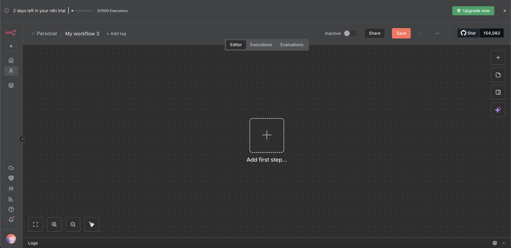
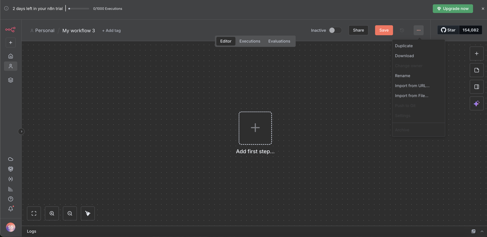
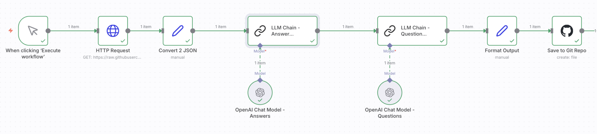

# DSC180A, Q1 repository

This repository contains assets and tools used to generate level-1 questions with an n8n-based workflow and some helper scripts/notebooks for data organization.

If you're reading this, you're either running the workflow locally, inspecting the generated data, or building a frontend that consumes the output. This README shows how to get set up step-by-step, explains the key files in plain language, and includes a short section for frontend folks at the bottom.

## Quick summary (in plain terms)

- What this is: an automated workflow (built with n8n) that pulls source JSON, runs AI nodes to produce questions, and saves the generated items into the `AIGeneratedData_n8n` output folder.
- Who it's for: data/ML engineers who want to run or modify the workflow, and frontend developers who want to read the produced JSON and render it.

## Contract (what this repo expects and produces)

- Inputs: source files in `ogData/` (CSV/JSON) and the `generated_level1_*.json` files in `AIGeneratedData_json/` used by the n8n workflow.
- Outputs: generated question files in `AIGeneratedData_n8n/` (JSON/plain text depending on node configuration).
- Success: you can run the n8n workflow and get new generated files in `AIGeneratedData_n8n/` or inspect them in n8n.
- Error modes: missing HTTP links in the workflow, AI node credit limits, or misconfigured GitHub/Git nodes if you expect push-to-repo behavior.

## Files in this repository (simple explanations)

- `data_organization.ipynb`, a Jupyter notebook that demonstrates how we preprocess and organize source data. If you want to see the data transformations or replicate them locally, open this file in Jupyter.
- `convert_to_json.py`, a small utility that converts txt data in `AIGeneratedData_n8n/` (for example) into JSON format. 
- `AIGeneratedData_json/`, folder containing JSON versions of previously generated level-1 items. These are the raw JSON files used as inputs for some workflow steps.
- `AIGeneratedData_n8n/`, folder containing text outputs produced by the n8n workflow. When the workflow runs, it creates new generated question files here (depending on how your n8n instance is configured to save or push files).
- `ogData/`, original raw data used as a source for generation and sampling (example: `level1.json`, `level1_clean.csv`, `level1_clean.json`).
- `data_organization.ipynb`, notebook with walkthroughs for data cleaning and organization.
- `test.txt`, placeholder file used for manual checks or quick tests.

If you're not familiar with notebooks: open `data_organization.ipynb` in Jupyter or VS Code and run the cells to see how the raw input is transformed into the JSON used by the workflow.

## Setup: how to run the n8n workflow (step-by-step)

This project uses n8n for workflows and some AI nodes. The instructions below assume you will use the hosted n8n at https://n8n.io/ and the AI nodes available there.

1. Create an n8n account

   - Visit: https://n8n.io/
   - Sign up for an account. At the time of writing, new accounts can get free AI credits, follow the on-screen prompts to accept these credits.

2. Download the notebook file from this repo

   - Go to this repository and download `dsc180a-q1-workflow.json` (you can use the green "Code" button or click the file and choose "Download").
   - We include the notebook so you can inspect and run the preprocessing locally if desired.

3. Create a new workflow in n8n

   - In n8n, click "Create" or the "New Workflow" area on the left side to start a fresh workflow.
   - 
   - To add the `dsc180a-q1-workflow.json` file to a node or attach it, you can drag/drop or upload as needed. (If you use n8n's file nodes, follow their UI prompts.)
   - 
   - At the very end you will see a workflow like this being displayed.
   - 

4. Modify the HTTP Request node

   - In the workflow there is a node named `HTTP Request` (the second node in the provided workflow).
   - Click that node and find the URL field where it fetches the input JSON.
   - Replace the existing URL with the RAW link to the repository JSON you want to use. Example steps to get the raw link:
     1. Visit: https://github.com/norahkerendian/dsc180a-q1/tree/main/AIGeneratedData_json
     2. Click `generated_level1_a.json`.
     3. Click the `RAW` button. That opens the raw JSON in a new tab. Copy the URL from that page.
     4. Paste that RAW URL into the `HTTP Request` node's URL field.

5. Accept AI credits in n8n and enable AI nodes

   - On the workflow editing screen you may see the AI nodes or an AI panel at the bottom. Click those AI nodes and follow the prompts to accept your free credits (look for the prompt that grants the trial 100 credits or similar).
   - If AI nodes require configuration (API keys, etc.), follow n8n's instructions to wire them up. In many cases the hosted n8n account includes an in-UI onboarding flow for AI credits.

6. Execute the workflow nodes

   - Click the first node at the very left of the workflow and use "Execute Node" to test it.
   - Inspect the node output in the right-hand panel. If it fetched the JSON correctly, you'll see the sample data.
   - Execute nodes in sequence (or click the last node to run the workflow end-to-end if n8n supports it). The last node in the workflow is the one that writes the final output.
   - After a successful run, the workflow should create new generated files. If the workflow is configured to write into the repository, the outputs end up inside `AIGeneratedData_n8n/` (note: writing directly to the GitHub repo from n8n requires a configured Git/GitHub node with appropriate credentials). If you do not have GitHub push configured, the output will be visible in your n8n execution log and may be downloadable from the node output.

7. Inspect the outputs
   - Open `AIGeneratedData_n8n/` in this repo (or download the outputs from n8n's node output) to view the newly generated items.
   - Each node typically includes the prompt or the code used to generate outputs, click any node to view its prompt and debug if results are unexpected.

8. Convert to JSON Format
   
   - Open `convert_to_json.py` in this repo and change the file name variable to the name of the txt file just saved to `AIGeneratedData_n8n/`.
   - Open your terminal and run the command `python convert_to_json.py`. This will convert the txt file to a JSON file saved in `AIGeneratedData_json/`.

## Common issues and fixes

- If the `HTTP Request` node returns 404: verify you copied the RAW URL (it typically begins with `https://raw.githubusercontent.com/` when opened via the RAW button).
- If AI node hits credit limits: double-check your n8n AI credits and ensure you accepted any trial credits during sign-up.
- If you expect files to appear in GitHub but they do not: confirm the workflow has a Git/GitHub node configured with write permissions; otherwise the workflow only stores the output in n8n.

## Simple troubleshooting checklist

1. Confirm the `HTTP Request` URL points to a valid raw JSON file.
2. Ensure AI nodes are enabled and you have credits.
3. Execute the first node and validate outputs step-by-step.
4. If the last node should push to GitHub, confirm the Git node is configured with a repo access token and correct branch.

## Frontend Work

THIS IS THE SECTION FOR FRONTEND
